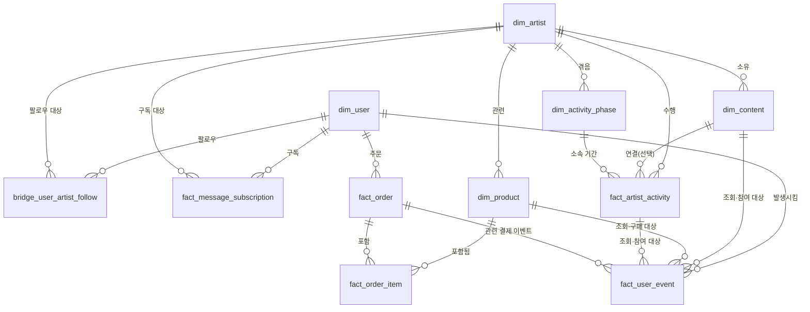
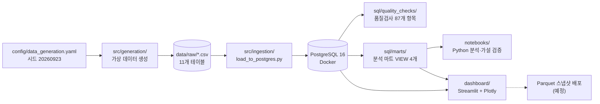

# FANLOG 사용자 행동 분석 대시보드


> `FANLOG`는 아티스트의 게시글·메시지·라이브 활동과 팬의 방문·참여·구매 행동을 연결하여, 소통 공백과 팬 활동 감소가 함께 나타나는 패턴 및 커머스 전환 과정을 분석하는 가상의 팬덤 플랫폼 운영 대시보드이다.

---

## TL;DR (5분 요약)

팬 커뮤니티와 아티스트 구독형 메시지 서비스를 합친 **가상의 팬덤 플랫폼 `FANLOG`**를 설계했습니다. 그 플랫폼의 아티스트 활동·팬 행동·커머스 데이터를 직접 생성해 PostgreSQL에 적재하고, SQL 마트와 Python 분석, Streamlit 대시보드까지 끝까지 만든 1인 포트폴리오 프로젝트입니다. 출발 질문은 **"아티스트 소통이 줄면 팬 활동도 줄어드는가?"**입니다. 모든 데이터는 가상이며 실제 서비스·회사의 데이터는 사용하지 않았습니다.

**핵심 발견 3가지** ([전체 보고서](docs/analysis_report.md))

1. 소통 공백이 4일 이상 길어지면 14일 이탈위험률이 6% 안팎, 8일 이상이면 7.83%까지 올라가는 등 공백과 이탈위험·휴면 비율이 함께 늘어나는 경향이 관찰됐다(전체 팬 n=80,138건 기준).
2. `artist_001`의 소통 활동일수-WAU 상관은 원본으로는 음의 상관(r=-0.449)이었지만, 신규 가입자 유입 추세를 통제한 편상관계수에서는 r_partial=+0.580으로 부호가 반전됐다.
3. 4단계 세그먼트에서 "참여"(27.4%)가 "조회중심"(35.8%)보다 구매 전환율이 낮은 역전이 있었으나, 코어 판정의 구매 이력 조건을 뺀 반사실 재계산에서는 참여(재정의) 전환율이 40.6%로 올라 역전이 사라지는 것이 확인됐다.

**대시보드**: `[배포 URL 추가 예정]`

**기술 스택**: Python · PostgreSQL · SQL · Streamlit · Plotly

---

## 1. 문제 정의

> 아티스트 소통과 팬 행동 데이터가 분리되어 있으면, 소통 공백과 팬 활동 감소가 같은 시기에 나타나는지 파악하고 어느 사용자 여정에서 이탈이 발생하는지 판단하기 어렵다. ([PRD](docs/PRD.md) 2.2절)

| ID | 세부 문제 | 발생 가능한 영향 |
| --- | --- | --- |
| P-01 | 아티스트 게시글·메시지·라이브 빈도와 팬 활동 변화를 같은 기준으로 비교하기 어렵다. | 소통 공백과 함께 나타나는 방문·참여 감소를 늦게 발견할 수 있다. |
| P-02 | 콘텐츠 조회는 많지만 좋아요·댓글 참여가 낮을 때 조회수만으로 반응을 판단하기 어렵다. | 콘텐츠 성과를 과대평가할 수 있다. |
| P-03 | 가입부터 팔로우·참여·구매까지의 행동이 개별 지표로 관리되면 주요 이탈 구간을 파악하기 어렵다. | 개선 우선순위를 결정하기 어렵다. |
| P-04 | 전체 평균만 보면 활동 수준에 따른 재방문·구매 차이가 가려질 수 있다. | 서로 다른 팬에게 동일한 운영 전략을 적용할 수 있다. |
| P-05 | 계정 삭제, 장기 미방문, 메시지 구독 해지가 모두 "이탈"로 혼용될 수 있다. | 분석마다 이탈률이 다르게 계산될 수 있다. |

분석 흐름은 지표를 따로 나열하지 않고, 아래의 하나의 사용자 여정으로 연결해서 봅니다.

```text
아티스트 소통 활동 → 팬의 콘텐츠 조회·참여 → 재방문 또는 휴면 → 상품 조회·장바구니·구매
```

---

## 2. 가설

| 가설 ID | 검증할 관계 | 주요 지표 | 주의점 |
| --- | --- | --- | --- |
| H-01 | 아티스트 소통 활동일이 많은 주에는 팬 활동과 다음 7일 재방문율이 높게 나타날 것이다. | 소통 활동일, WAU, W1 참여 재방문율 | 컴백·공연 등 동시 영향을 고려한다. |
| H-02 | 연속 소통 공백이 길수록 14일 이탈 위험 및 30일 휴면 비율이 높게 나타날 것이다. | 최대 공백일, 이탈 위험률, 휴면율 | 상관관계를 직접적인 원인으로 해석하지 않는다. |
| H-03 | 참여·코어 팬은 조회 중심 팬보다 상품 조회→구매 전환율이 높게 나타날 것이다. | 팬 세그먼트, 참여율, 구매 전환율 | 소득과 구매력 등 관측되지 않은 요인이 존재한다. |

---

## 3. 데이터

> ⚠️ **모든 데이터는 이 프로젝트를 위해 생성한 가상 데이터입니다.** 가상 데이터에 설정한 규칙을 분석에서 다시 발견하고 실제 인사이트처럼 표현하지 않도록 다음 원칙을 적용했습니다 ([PRD](docs/PRD.md) 13.4절).
>
> - 생성 규칙에 확률과 잡음을 넣어 모든 관계가 완벽하게 나타나지 않도록 했습니다.
> - `communication_effect=0`인 비교 시나리오(null_effect)를 따로 생성했습니다. 분석 로직이 항상 같은 결과를 내지 않는지 이 시나리오로 확인했습니다.
> - 결과는 "실제 팬덤에 대한 발견"이 아니라 **"가정한 시나리오의 탐지 결과"**로 표현합니다.

**규모** (설정 `config/data_generation.yaml` v1.8, 난수 시드 `20260923`)

| 항목 | 값 |
| --- | --- |
| 가상 팬 | 1,750명 (다중 아티스트 팔로우 허용) |
| 가상 아티스트 | 3팀 |
| 분석 기간 | 90일 (2026-01-01 ~ 2026-03-31, KST) |
| 테이블 | 11개 (차원 5 · 관계 2 · 팩트 4) + 분석 마트 VIEW 4개 |
| 사용자 이벤트 | 129,595건 · 17종 (GA4 방식 이벤트 설계) |
| 주문 | 1,039건 (구매·일부 환불 포함) |

아티스트가 공급한 소통(`fact_artist_activity`)과 팬이 실제로 반응한 행동(`fact_user_event`)은 별도 테이블로 분리했습니다. "소통을 얼마나 공급했나"와 "팬이 얼마나 반응했나"를 구분해야 H-01·H-02를 검증할 수 있기 때문입니다.

**ERD** (컬럼 정의는 [data_dictionary.md](docs/data_dictionary.md) 참고)



---

## 4. 분석 방법



- **분석 방법**: 열린 퍼널과 순서 기반 닫힌 퍼널을 분리해 계산했습니다. 통계 방법은 Spearman 상관(Fisher z 95% 신뢰구간), 누적 가입자 수를 통제한 편상관, Mann-Whitney U 검정을 썼습니다. 여기에 PRD 11.1절 규칙 기반 팬 세그먼트와 반사실(counterfactual) 재계산을 더했습니다.
- **데이터 품질**: `sql/quality_checks/`의 5개 그룹 **87개 세부 항목**(기본키·외래키·결측, 시간 순서, 허용값, 구매·환불 정합성, UTC→KST 타임존)을 전수 실행했고 **위반 0건**이었습니다. 이 중 대표 규칙 3개(DQ-01·DQ-03·DQ-10)는 pandas로도 따로 다시 계산해 같은 결과를 확인했습니다 (`notebooks/01_data_validation.ipynb`).
- **재현성**: 같은 시드로 처음부터 다시 생성하면 11개 테이블 전체가 바이트 단위로 동일합니다. 타임존 버그 재발을 막는 pytest 회귀 테스트는 `tests/test_time_utils.py`에 있습니다.
- **순환 논리 점검**: null_effect 시나리오에서는 활동기와 비활동기의 노출률 차이가 +0.0276(baseline)에서 +0.0022로 거의 사라졌습니다. 분석이 찾아낸 관계가 생성 규칙의 스위치에서 온다는 점을 확인한 것입니다.
- **통계 표현 원칙**: 모든 비율에 분자·분모를 함께 표시하고, 분모가 0이면 "계산 불가"로 처리합니다. 상관관계는 인과관계로 표현하지 않습니다 (PRD 14.6절).

---

## 5. 핵심 발견

**발견 1. 소통 공백이 길수록 이탈위험·휴면 비율이 함께 높아진다 (H-02).** 팔로우 중인 아티스트들의 공백일 중 최솟값을 그날의 "체감 공백"으로 정의했습니다. 이 기준으로 전체 팬(n=80,138건)을 보면, 공백 0일일 때 14일 이탈위험률은 1.88%, 8일 이상일 때는 7.83%로 단조 증가했습니다. 30일 휴면율도 0.03%에서 0.52%로 함께 늘었습니다. 운영 관점에서는 공백이 4일을 넘긴 팬을 재참여 유도의 우선 대상으로 볼 수 있습니다. 다만 공백이 이탈을 "유발"한다고 단정할 수는 없습니다.

**발견 2. 신규 가입 추세를 통제하자 소통-WAU 상관의 부호가 뒤집혔다 (H-01).** `artist_001`의 주간 소통 활동일수와 WAU는 원본 상관이 r=-0.449로 가설과 반대였습니다. 그러나 누적 가입자 수를 통제하자 r_partial=+0.580으로 바뀌었습니다. 신규 유입으로 WAU가 우상향한 시간 추세가 착시를 만들었을 가능성을 보여줍니다. 다만 표본이 작아(n=12) 통제 후에도 `artist_002`(p=0.024)를 제외하면 통계적으로 유의하지 않습니다.

**발견 3. "참여 < 조회중심" 역전은 세그먼트 정의의 순환성이 만든 인공물이었다 (H-03).** 코어 판정에 "최근 30일 구매 이력"이 들어 있어, 참여 팬 중 구매까지 한 고전환 인원이 먼저 코어로 빠져나갔습니다. 구매 이력 조건을 뺀 반사실 재계산에서는 참여 전환율이 27.4%에서 40.6%로 올라, 조회중심(35.8%)을 넘으며 역전이 사라졌습니다.

👉 **[전체 보고서 보기](docs/analysis_report.md)**: 각 발견의 분자/분모, 신뢰구간, 더 파고든 과정, 후속 실험 제안을 담았습니다.

---

## 6. 대시보드

3페이지로 구성된 Streamlit 대시보드입니다. 모든 페이지에 "가상 데이터 프로젝트" 배지와 인과 해석 주의문을 표시합니다.

**대시보드 URL**: `[배포 URL 추가 예정]`

### Page 1 — 종합 현황

DAU·WAU, W1 재방문율, 14일 이탈위험률, 콘텐츠 참여율, 구매 전환율 KPI를 이전 동일 기간 대비 변화와 함께 보여줍니다. 아티스트별 비교, 조회는 높고 참여는 낮은 콘텐츠, 팬 세그먼트 구성도 이 페이지에 있습니다.

<!-- TODO: 실제 캡처 이미지로 교체 -->


### Page 2 — 아티스트 소통·리텐션

주별 게시글·메시지·라이브 추이와 WAU를 함께 보여주고, 소통 공백 구간별 이탈위험률·휴면율을 비교합니다. 소통 빈도와 WAU의 동시·1주 시차 상관, 누적 가입자 수 통제 편상관도 볼 수 있습니다. 부호가 반전됐는지 여부는 계산 결과에 따라 문구가 자동으로 바뀝니다.

<!-- TODO: 실제 캡처 이미지로 교체 -->


### Page 3 — 팬 행동·커머스 퍼널

열린 커머스 퍼널(첫 관심 → 장바구니 → 결제 시작 → 구매)과 매출·환불을 보여줍니다. 매출·환불은 마트가 아니라 `fact_order` 기준입니다. 팬 세그먼트별 구매 전환율과 코어 정의 반사실 비교(역전 해소 여부를 자동 판정), 구매까지 걸린 시간 분포도 있습니다.

<!-- TODO: 실제 캡처 이미지로 교체 -->


---

## 7. 한계

- **가상 데이터이며 인과관계가 아니다.** 모든 수치는 가정한 생성 규칙의 탐지 결과입니다. 관찰된 관계는 상관관계이고, 실제 서비스에 적용하려면 실제 데이터 분석과 실험(A/B 테스트 등)이 따로 필요합니다 (PRD 13.4절·SC-10).
- **표본이 작은 결과가 있다.** 아티스트별 주간 상관은 n=11~12 수준이라 신뢰구간이 넓고 대부분 0을 가로지릅니다. 상관 강도 기준(|r|<0.3 약함 등)도 여러 통용 기준 중 하나일 뿐입니다.
- **정의에 따라 결과가 민감하게 달라진다.** 다중 팔로우 팬의 공백을 최솟값으로 정의한 방식, 코어 판정 시간창(30일 기준 394명 vs 생애 전체 기준 788명), 재방문 지표 정의(비공식 스냅샷 vs PRD 공식 W1)가 모두 결과를 바꿀 수 있습니다. 재방문 지표는 정의에 따라 세그먼트 순위까지 달라집니다.
- **활동 단계 비교는 시간 추세와 얽혀 있다.** 활동 단계가 90일 안에서 겹치지 않는 시간순 구간으로 배정돼 있습니다. 그래서 "활동기 vs 비활동기" 비교는 "분석 초반 vs 후반" 비교와 섞입니다.

전체 한계 목록은 [analysis_report.md](docs/analysis_report.md) 3절과 [decisions_log.md](docs/decisions_log.md) 11·12절에 있습니다.

---

## 8. 로컬 개발 환경 설정

### 8.1 PostgreSQL (Docker Compose)

로컬에서 PostgreSQL을 Docker Compose로 띄워 분석용 데이터베이스로 사용합니다.

1. `.env.example`을 복사해서 `.env`를 만들고, `POSTGRES_PASSWORD`를 원하는 값으로 바꿉니다.
2. `docker compose up -d`를 실행합니다(PostgreSQL이 백그라운드로 실행됩니다).
3. DBeaver에서 새 연결을 만듭니다. Host=`localhost`, Port=`.env`의 `POSTGRES_PORT`로 두고, Database/User/Password는 `.env` 값과 동일하게 입력합니다.
4. 종료할 때는 `docker compose down`을 씁니다. 데이터는 volume에 남아 있어 다시 up하면 유지됩니다. 완전히 초기화하려면 `docker compose down -v`를 사용합니다.

#### 문제 해결

- **DBeaver 접속 시 비밀번호 인증 실패**: 로컬에 이미 PostgreSQL이 설치되어 5432 포트를 쓰고 있다면(`netstat -ano | findstr :5432`로 확인 가능), Docker 컨테이너와 포트가 충돌해 엉뚱한 서버로 연결될 수 있습니다. `.env`의 `POSTGRES_PORT`를 5433 등 비어 있는 포트로 바꾸고 `docker compose down -v && docker compose up -d`로 재시작합니다. DBeaver 연결 설정의 Port도 같은 값으로 맞춥니다. (`.env.example`의 기본값은 이미 5433입니다.)
- **Python에서 DB 연결 타임아웃**: Docker Desktop이 실행 중인지, `docker ps`에 `fanlog_postgres`가 `Up` 상태인지 확인합니다.

### 8.2 Python 가상환경

Python 3.14 기준으로 개발했습니다.

```bash
python -m venv .venv
# Windows
.venv\Scripts\activate
# macOS / Linux
source .venv/bin/activate

pip install -r requirements.txt
```

### 8.3 가상 데이터 생성

모든 생성 파라미터는 `config/data_generation.yaml` 하나에서 읽습니다. 아래 순서대로 실행하면 `data/raw/`에 11개 테이블 CSV가 생성됩니다. 각 단계가 앞 단계의 CSV를 입력으로 쓰므로 순서를 지켜야 합니다.

```bash
# 1) 차원 테이블: dim_artist, dim_user, dim_activity_phase, dim_content, dim_product
python src/generation/generate_dimensions.py --user-count 1750

# 2) 관계·활동 테이블: fact_artist_activity, bridge_user_artist_follow, fact_message_subscription
python src/generation/generate_facts.py

# 3) 사용자 이벤트 17종 + 주문: fact_user_event, fact_order, fact_order_item (baseline 시나리오)
python src/generation/generate_events.py

# (선택) 순환 논리 점검용 null_effect 비교 데이터 — 02 노트북이 이 파일명을 참조한다
python src/generation/generate_events.py --scenario null_effect --output-filename fact_user_event_null_effect_full.csv
```

> `--user-count`의 기본값은 테스트용 50명입니다. 분석 결과를 재현하려면 반드시 `1750`을 지정해야 합니다.

### 8.4 PostgreSQL 적재

`sql/ddl/`의 DDL로 테이블을 만든 뒤 `data/raw/*.csv`를 외래키 의존 순서대로 적재하고 행 수를 검증합니다.

```bash
python src/ingestion/load_to_postgres.py --reset
```

`--reset`은 기존 테이블을 `DROP TABLE ... CASCADE`로 지우고 다시 만듭니다. 이때 분석 마트 VIEW도 함께 지워지므로, 적재 후에는 아래 8.5절의 마트 생성을 다시 실행해야 합니다.

### 8.5 분석 마트 생성 및 SQL 품질검사

로컬에 `psql`이 없어도 컨테이너 안의 `psql`로 실행할 수 있습니다. `run_all.sql`은 `\i sql/quality_checks/...` 상대 경로로 개별 파일을 불러오므로, `sql/` 폴더를 컨테이너에 복사한 뒤 루트(`/`)를 작업 디렉터리로 두고 실행합니다. 아래 명령은 `.env.example`의 기본 DB·사용자 이름 기준입니다.

```bash
docker cp sql fanlog_postgres:/sql

# 분석 마트 VIEW 4개 생성
docker exec -w / fanlog_postgres psql -U fanlog_user -d fanlog -f sql/marts/001_mart_artist_daily.sql
docker exec -w / fanlog_postgres psql -U fanlog_user -d fanlog -f sql/marts/002_mart_user_daily.sql
docker exec -w / fanlog_postgres psql -U fanlog_user -d fanlog -f sql/marts/003_mart_content_performance.sql
docker exec -w / fanlog_postgres psql -U fanlog_user -d fanlog -f sql/marts/004_mart_commerce_funnel.sql

# 품질검사 87개 항목 통합 실행 — 첫 번째 결과 표의 violation_count가 전부 0이어야 정상
docker exec -w / fanlog_postgres psql -U fanlog_user -d fanlog -f sql/quality_checks/run_all.sql
```

로컬에 `psql`이 설치돼 있다면 프로젝트 루트에서 바로 실행해도 됩니다: `psql -h localhost -p 5433 -U fanlog_user -d fanlog -f sql/quality_checks/run_all.sql`.

### 8.6 테스트 및 분석 노트북

```bash
pytest tests/
jupyter notebook notebooks/   # 01_data_validation → 02_communication_retention → 03_commerce_funnel 순서
```

### 8.7 대시보드 실행

```bash
streamlit run dashboard/app.py
```

브라우저에서 `http://localhost:8501`이 열립니다. 현재 대시보드는 로컬 PostgreSQL(`.env` 연결 정보)에서 직접 데이터를 읽습니다. 배포용 Parquet 스냅샷 방식(PRD 16.3절)은 아직 구현 전입니다.

---

## 9. 리포지토리 구조

```text
fanlog-user-behavior-analytics/
├─ README.md
├─ .gitignore
├─ .env.example                  # DB 접속 정보 템플릿 (.env는 Git 제외)
├─ docker-compose.yml            # PostgreSQL 16 컨테이너
├─ requirements.txt
├─ config/
│  ├─ data_generation.yaml       # 생성 파라미터 단일 기준 (v1.8, 시드 20260923)
│  └─ sensitivity_scenario.yaml  # baseline / null_effect 시나리오
├─ data/
│  └─ raw/                       # 생성된 CSV (Git 제외, 8.3절로 재생성)
├─ docs/
│  ├─ PRD.md
│  ├─ event_tracking_plan.md
│  ├─ data_dictionary.md
│  ├─ analysis_report.md
│  └─ decisions_log.md           # 설계 결정의 배경과 검토 필요 항목
├─ sql/
│  ├─ ddl/                       # 001_dimensions ~ 005_indexes
│  ├─ marts/                     # 001_mart_artist_daily ~ 004_mart_commerce_funnel (VIEW)
│  └─ quality_checks/            # 001~005 규칙 그룹 + run_all.sql
├─ src/
│  ├─ generation/
│  │  ├─ config_loader.py
│  │  ├─ time_utils.py           # UTC/KST 공용 시간 헬퍼
│  │  ├─ generate_dimensions.py
│  │  ├─ generate_facts.py
│  │  └─ generate_events.py
│  ├─ ingestion/
│  │  └─ load_to_postgres.py
│  └─ analysis/
│     └─ db.py                   # SQLAlchemy 연결 헬퍼
├─ notebooks/
│  ├─ 01_data_validation.ipynb
│  ├─ 02_communication_retention.ipynb
│  └─ 03_commerce_funnel.ipynb
├─ dashboard/
│  ├─ app.py                     # 진입점
│  ├─ theme.py                   # 디자인 토큰·공통 렌더러
│  ├─ data.py                    # 대시보드용 데이터 함수
│  └─ pages/
│     ├─ 01_overview.py
│     ├─ 02_communication_retention.py
│     └─ 03_commerce_funnel.py
└─ tests/
   └─ test_time_utils.py
```

> 스크린샷을 넣을 `assets/` 폴더와 배포용 `data/processed/`(Parquet 스냅샷)는 아직 만들지 않았습니다.

---

## 10. 기술 스택

| 영역 | 도구 | 사용 목적 |
| --- | --- | --- |
| 언어 | Python 3.14 | 데이터 생성·분석·대시보드 |
| 데이터 처리 | pandas, NumPy | 전처리와 집계 |
| 가상 데이터 | NumPy random (시드 고정), PyYAML | 재현 가능한 생성, YAML 설정 로드 |
| 데이터베이스 | PostgreSQL 16 (Docker Compose) | 관계형 모델, SQL 마트, 품질검사 |
| DB 연결 | SQLAlchemy, psycopg, python-dotenv | Python↔PostgreSQL 연결, `.env` 비밀값 분리 |
| 통계 | SciPy | Spearman 상관, Mann-Whitney U |
| 분석 환경 | Jupyter, nbformat, nbclient | 분석 노트북 작성·일괄 실행 |
| 시각화 | Plotly, Matplotlib, Seaborn | 대시보드 대화형 차트, 노트북 정적 차트 |
| 대시보드 | Streamlit | 3페이지 운영 대시보드 |
| 테스트 | pytest | 시간 유틸 회귀 테스트 |
| 버전 관리 | Git, GitHub | 코드·문서·변경 이력 관리 |

> `requirements.txt`에는 Faker도 들어 있지만, 현재 생성 코드는 이를 사용하지 않고 NumPy 난수만 사용합니다.

---

## 11. 작성자 정보 및 문의

- **작성자**: [이름]
- **연락처**: [이메일]
- **GitHub**: [GitHub 프로필 URL]

이 프로젝트는 엔터테인먼트 업계 데이터 분석 직무 지원을 위한 1인 포트폴리오입니다. 실제 서비스(팬 커뮤니티, 아티스트 메시지 구독 서비스 등)의 사용 경험을 참고해 구조를 설계했지만, 어떤 회사의 실제 데이터도 사용하지 않았습니다. 설계 결정의 배경은 [docs/decisions_log.md](docs/decisions_log.md)에 정리되어 있습니다.
