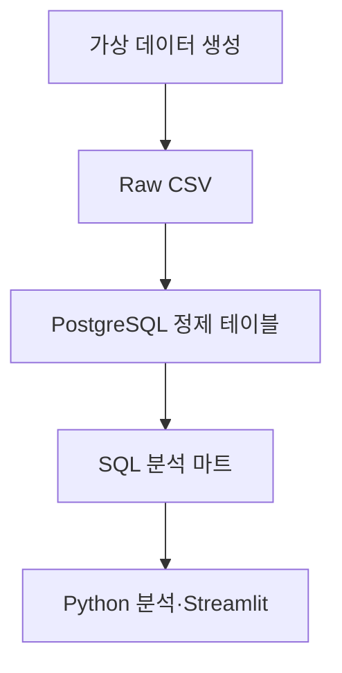

# FANLOG 사용자 행동 분석 대시보드 PRD

> 아티스트 소통 변화가 팬의 참여·재방문·휴면 및 상품 구매 행동과 어떤 관계를 보이는지 분석하는 가상 팬덤 플랫폼 운영 대시보드

| 항목 | 내용 |
| --- | --- |
| 문서 버전 | v1.1 |
| 문서 상태 | MVP 구현 기준안 |
| 작성자 | 전예진 |
| 작성일 | 2026-09-23 |
| 프로젝트 유형 | 개인 포트폴리오 · 사용자 행동 분석 · 운영 대시보드 |
| 분석 대상 | 가상의 통합 아이돌 팬덤 플랫폼 `FANLOG` |
| 핵심 분석 축 | 아티스트 소통 → 팬 참여·재방문 → 커머스 전환 |
| 최종 결과물 | 가상 데이터, PostgreSQL, SQL·Python 분석, Streamlit 3페이지 대시보드, 분석 보고서 |
| 데이터 원칙 | 실제 팬·아티스트 개인정보 및 실제 플랫폼 내부 데이터를 사용하지 않음 |
| 기준 시간대 | 저장 UTC, 분석·표시 `Asia/Seoul`(KST) |

## 문서 변경 이력

| 버전 | 날짜 | 변경 내용 |
| --- | --- | --- |
| v1.0 | 2026-09-23 | 전체 서비스 분석을 가정한 최초 PRD 작성 |
| v1.1 | 2026-09-23 | 1인 프로젝트의 완주 가능성을 고려해 데이터 규모, 분석 범위, 대시보드 및 기술 요구사항을 MVP 수준으로 축소 |

---

## 0. 요약

### 0.1 한 문장 정의

`FANLOG`는 아티스트의 게시글·메시지·라이브 활동과 팬의 방문·참여·구매 행동을 연결하여, 소통 공백과 팬 활동 감소가 함께 나타나는 패턴 및 커머스 전환 과정을 분석하는 가상의 팬덤 플랫폼 운영 대시보드이다.

### 0.2 핵심 분석 흐름

```text
아티스트 소통 활동
→ 팬의 콘텐츠 조회·참여
→ 재방문 또는 휴면
→ 상품 조회·장바구니·구매
```

본 프로젝트는 각각의 지표를 독립적으로 나열하는 것이 아니라, 아티스트 소통에서 팬 활동과 구매로 이어지는 하나의 사용자 여정으로 분석한다.

### 0.3 MVP 결과물

- 고정된 시드로 재생성할 수 있는 가상 사용자 행동 데이터
- 아티스트 게시글·메시지·라이브 활동 데이터
- 상품 조회부터 구매까지의 커머스 퍼널 데이터
- PostgreSQL 기반 관계형 데이터 모델과 분석 마트
- SQL·Python 기반 리텐션·소통·퍼널·세그먼트 분석
- Streamlit 기반 3페이지 운영 대시보드
- 핵심 발견 3개와 한계·후속 실험을 정리한 분석 보고서
- 채용 담당자가 빠르게 확인할 수 있는 프로젝트 README

### 0.4 MVP에서 하지 않는 것

- 실제 팬 커뮤니티나 메시지 앱을 개발하지 않는다.
- 실제 FANS, bubble 또는 특정 엔터테인먼트 회사의 내부 데이터를 사용하지 않는다.
- 실제 팬 게시글이나 SNS 게시글을 수집하지 않는다.
- 텍스트 감성 분석과 주제 분류 모델을 MVP에 포함하지 않는다.
- 머신러닝 기반 이탈 예측이나 개인별 추천을 구현하지 않는다.
- 실제 GA4 속성을 연결하거나 마케팅 캠페인을 운영하지 않는다.
- 관찰된 상관관계를 인과관계로 단정하지 않는다.
- 가상 데이터 결과를 실제 팬덤 전체의 특성으로 일반화하지 않는다.

---

## 1. 프로젝트 개요

본 프로젝트는 가상의 아이돌 팬덤 플랫폼 `FANLOG`에서 발생하는 아티스트 활동과 팬 행동 데이터를 설계·생성하고, 이를 분석하여 주요 운영 지표를 확인할 수 있는 대시보드를 구현하는 프로젝트이다.

회원가입, 아티스트 팔로우, 유료 메시지 구독, 게시글·메시지·라이브 조회, 콘텐츠 좋아요·댓글, 상품 조회, 장바구니 추가 및 구매로 이어지는 사용자 여정을 기준으로 가상 데이터를 구성한다.

아티스트의 게시글·메시지·라이브 활동 빈도와 연속 소통 공백을 팬의 방문, 참여, 재방문 및 휴면 지표와 비교한다. 이후 팬의 활동 수준이 상품 조회와 구매 전환에 어떤 차이로 나타나는지 분석한다.

본 프로젝트는 상용 팬덤 플랫폼의 커뮤니티·메시지·콘텐츠·커머스 이용 경험을 참고한 비공식 개인 프로젝트이다. 모든 아티스트·팬·콘텐츠·상품은 가상이며, 특정 회사의 실제 데이터나 비공개 운영 정보를 사용하지 않는다.

---

## 2. 프로젝트 배경과 문제 정의

### 2.1 팬덤 플랫폼의 이용 목적

팬덤 플랫폼은 팬이 좋아하는 아티스트의 소식과 콘텐츠를 확인하고, 게시글·메시지·라이브 등을 통해 아티스트와 지속적으로 연결되기 위해 이용하는 서비스이다.

일반적인 소셜 플랫폼과 달리 특정 아티스트가 가입과 활동의 중심이 되므로, 아티스트의 소통과 콘텐츠 공급은 사용자의 방문과 참여를 유지하는 주요 요인이 될 수 있다.

또한 팬덤 플랫폼에서는 콘텐츠 소비, 아티스트 소통, 상품 구매가 하나의 서비스 안에서 연결되므로 사용자 행동을 개별 기능이 아닌 전체 여정으로 살펴볼 필요가 있다.

### 2.2 핵심 문제 문장

> 아티스트 소통과 팬 행동 데이터가 분리되어 있으면, 소통 공백과 팬 활동 감소가 같은 시기에 나타나는지 파악하고 어느 사용자 여정에서 이탈이 발생하는지 판단하기 어렵다.

### 2.3 세부 문제

| 문제 ID | 세부 문제 | 발생 가능한 영향 |
| --- | --- | --- |
| P-01 | 아티스트 게시글·메시지·라이브 빈도와 팬 활동 변화를 같은 기준으로 비교하기 어렵다. | 소통 공백과 함께 나타나는 방문·참여 감소를 늦게 발견할 수 있다. |
| P-02 | 콘텐츠 조회는 많지만 좋아요·댓글 참여가 낮을 때 조회수만으로 콘텐츠 반응을 판단하기 어렵다. | 콘텐츠 성과를 과대평가할 수 있다. |
| P-03 | 회원가입부터 팔로우·참여·구매까지의 행동이 개별 지표로 관리되면 주요 이탈 구간을 파악하기 어렵다. | 개선 우선순위를 결정하기 어렵다. |
| P-04 | 전체 평균만 보면 팬의 활동 수준에 따른 재방문·구매 차이가 가려질 수 있다. | 서로 다른 팬에게 동일한 운영 전략을 적용할 수 있다. |
| P-05 | 계정 삭제, 장기 미방문, 메시지 구독 해지가 모두 `이탈`로 혼용될 수 있다. | 분석마다 이탈률이 다르게 계산될 수 있다. |

### 2.4 분석 제약

- 실제 플랫폼 데이터가 아닌 가상 데이터이므로 실제 사업 효과를 입증할 수 없다.
- 아티스트 소통에 자주 노출되는 팬은 원래 활동성이 높은 팬일 수 있다.
- 소통과 팬 활동이 함께 증가해도 컴백·공연·상품 출시 등 다른 요인이 영향을 주었을 수 있다.
- 가상 데이터의 패턴은 데이터 생성 규칙의 영향을 받는다.
- 본 프로젝트의 분석 결과는 실제 팬덤에 대한 결론이 아니라 분석 구조와 탐지 가능성을 검증한 결과이다.

---

## 3. 프로젝트 목표

### 3.1 핵심 목표

아티스트 소통 활동, 팬 참여·재방문 및 상품 구매 데이터를 연결하여 운영자가 팬 활동 감소와 사용자 여정의 이탈 지점을 확인할 수 있는 재현 가능한 분석 대시보드를 구현한다.

### 3.2 세부 목표

| 목표 ID | 세부 목표 | 연결 문제 |
| --- | --- | --- |
| G-01 | 아티스트의 게시글·메시지·라이브 활동과 팬의 방문·참여 추이를 비교한다. | P-01 |
| G-02 | 소통 공백 길이에 따른 팬의 재방문·이탈 위험·휴면 비율을 분석한다. | P-01, P-05 |
| G-03 | 콘텐츠 조회 대비 좋아요·댓글 참여율을 분석한다. | P-02 |
| G-04 | 회원가입부터 콘텐츠 참여와 상품 구매까지의 퍼널을 분석한다. | P-03 |
| G-05 | 팬을 활동 수준에 따라 구분하고 세그먼트별 재방문·구매 특성을 비교한다. | P-04 |
| G-06 | 분석 근거와 한계를 함께 제시하고 후속 운영 실험을 제안한다. | P-01~P-05 |

### 3.3 프로젝트 성공 기준

| 성공 기준 ID | 완료 조건 |
| --- | --- |
| SC-01 | 고정된 시드와 설정 파일로 동일한 가상 데이터를 다시 생성할 수 있다. |
| SC-02 | 아티스트 활동과 팬 행동을 아티스트·사용자·기간 기준으로 연결할 수 있다. |
| SC-03 | 기본키·외래키·시간 순서·주문 금액 검증을 자동 수행한다. |
| SC-04 | 온보딩·콘텐츠·커머스 퍼널의 전환율과 이탈률을 계산할 수 있다. |
| SC-05 | 아티스트 소통과 팬 재방문·휴면의 동시 및 시차 관계를 비교할 수 있다. |
| SC-06 | 설명 가능한 규칙으로 팬 세그먼트를 만들고 행동 차이를 비교할 수 있다. |
| SC-07 | Streamlit 대시보드 3페이지를 구현한다. |
| SC-08 | 대시보드의 핵심 지표가 SQL 또는 Python 검산 결과와 일치한다. |
| SC-09 | 최소 3개의 근거 기반 발견과 후속 실험안을 제시한다. |
| SC-10 | 가상 데이터와 인과 해석의 한계를 대시보드와 보고서에 표시한다. |

---

## 4. 프로젝트 범위

### 4.1 MVP 포함 범위

| 영역 | 포함 내용 |
| --- | --- |
| 데이터 기획 | 서비스 가정, 이벤트 명세, 지표 사전, 데이터 모델 |
| 데이터 생성 | 팬·아티스트·콘텐츠·소통 활동·상품·주문·행동 이벤트 생성 |
| 데이터 저장 | CSV 원본·정제 데이터와 PostgreSQL 분석 테이블 |
| 사용자 분석 | DAU·WAU·재방문·이탈 위험·휴면 |
| 소통 분석 | 게시글·메시지·라이브 빈도, 소통 활동일, 연속 공백 |
| 콘텐츠 분석 | 고유 조회자, 좋아요·댓글 참여율 |
| 커머스 분석 | 상품 조회, 장바구니, 결제 시작, 구매, 환불 |
| 팬 세그먼트 | 조회 중심·참여·코어 팬과 활동 상태 구분 |
| 대시보드 | 종합 현황, 소통·리텐션, 커머스 퍼널 총 3페이지 |
| 검증 | 데이터 품질검사, SQL·Python 지표 검산, 화면 QA |
| 문서화 | PRD, 데이터 사전, 이벤트 명세, README, 분석 보고서 |

### 4.2 MVP 제외 범위

- 실제 회원가입·로그인·메시지·커뮤니티·결제 기능 개발
- 실제 FANS·bubble·X 및 기타 SNS 데이터 수집
- 팬 커뮤니티 자유 텍스트 생성 및 감성·주제 분석
- 머신러닝 기반 팬 군집화 및 이탈 예측
- 실시간 데이터 처리와 자동 알림
- 실제 GA4·광고·마케팅 도구 연동
- 개인 팬 단위의 자동 타기팅
- 결제대행·배송·재고관리 시스템 구현
- 실제 사업 효과에 대한 인과 추론

### 4.3 확장 범위

- 가상 팬 커뮤니티 게시글과 TF-IDF 키워드 분석
- 규칙 기반 주제 분류 및 감성 분석
- 비지도 학습 기반 팬 군집화
- A/B 테스트 결과 시뮬레이션
- 이상징후 자동 알림
- 데이터 규모 확대와 증분 적재

---

## 5. 사용자와 사용자 스토리

### 5.1 주요 대시보드 사용자

| 사용자 유형 | 주요 관심사 | 필요한 판단 |
| --- | --- | --- |
| 서비스·프로덕트 기획자 | 전체 사용자 여정과 리텐션 | 어떤 단계와 기능을 우선 개선할 것인가? |
| 팬 플랫폼 운영자 | 아티스트 소통 공백과 팬 활동 감소 | 어느 아티스트·기간을 우선 점검할 것인가? |
| 콘텐츠 운영자 | 콘텐츠 조회와 참여율 | 조회는 높지만 참여가 낮은 콘텐츠는 무엇인가? |
| MD·커머스 기획자 | 상품 퍼널과 팬 유형별 전환 | 어느 상품·단계의 개선이 필요한가? |
| 데이터 분석가 | 지표 일관성, 세그먼트, 분석 한계 | 어떤 관계가 관찰되며 어디까지 해석할 수 있는가? |

### 5.2 핵심 사용자 스토리

| ID | 사용자 스토리 |
| --- | --- |
| US-01 | 운영자로서 아티스트별 소통 빈도와 팬 활동 추이를 함께 확인하고 싶다. |
| US-02 | 기획자로서 소통 공백 길이에 따라 재방문과 휴면 비율이 어떻게 달라지는지 비교하고 싶다. |
| US-03 | 콘텐츠 담당자로서 조회 대비 참여가 낮은 콘텐츠를 찾고 싶다. |
| US-04 | 커머스 담당자로서 상품 조회부터 구매까지 이탈이 가장 큰 단계를 확인하고 싶다. |
| US-05 | 분석가로서 팬 세그먼트별 참여·재방문·구매 차이를 비교하고 싶다. |
| US-06 | 모든 사용자로서 지표 정의와 가상 데이터의 한계를 확인하고 싶다. |

---

## 6. 분석 대상 서비스 가정

### 6.1 FANLOG 핵심 기능

| 기능 영역 | 서비스 가정 | 주요 데이터 |
| --- | --- | --- |
| 회원 | 팬이 가입하고 세션을 시작한다. | 가입, 세션 |
| 아티스트 탐색 | 팬이 관심 아티스트를 조회하고 팔로우한다. | 아티스트 조회, 팔로우 |
| 유료 메시지 | 팬이 메시지를 구독하고 아티스트 메시지를 열람한다. | 구독, 메시지 발송·열람·해지 |
| 공식 소통 | 아티스트가 게시글·메시지·라이브를 제공한다. | 활동 유형, 발생 시각 |
| 콘텐츠 | 팬이 공지·사진·영상·라이브 다시보기를 조회하고 반응한다. | 조회, 좋아요, 댓글 |
| MD 스토어 | 팬이 상품을 조회하고 장바구니·결제·구매를 진행한다. | 상품 조회, 장바구니, 구매, 환불 |

### 6.2 팬 사용자 여정

```text
유입
→ 회원가입
→ 아티스트 조회·팔로우
→ 게시글·메시지·라이브·콘텐츠 이용
→ 좋아요·댓글 참여
→ 상품 조회
→ 장바구니
→ 결제 시작
→ 구매
→ 재방문 또는 휴면
```

모든 팬이 위 순서를 그대로 따르는 것은 아니다. 메시지를 구독하지 않거나 콘텐츠 참여 없이 상품을 구매하는 팬도 존재할 수 있다.

### 6.3 운영자 분석 흐름

```text
핵심 지표 변화 발견
→ 아티스트·기간 필터 적용
→ 소통 활동과 팬 활동 추이 비교
→ 소통 공백과 재방문·휴면 확인
→ 커머스 퍼널과 팬 세그먼트 확인
→ 분석 한계 검토
→ 후속 운영 실험 제안
```

---

## 7. 분석 가설과 핵심 질문

### 7.1 핵심 가설

| 가설 ID | 검증할 관계 | 주요 지표 | 주의점 |
| --- | --- | --- | --- |
| H-01 | 아티스트 소통 활동일이 많은 주에는 팬 활동과 다음 7일 재방문율이 높게 나타날 것이다. | 소통 활동일, WAU, W1 참여 재방문율 | 컴백·공연 등 동시 영향을 고려한다. |
| H-02 | 연속 소통 공백이 길수록 14일 이탈 위험 및 30일 휴면 비율이 높게 나타날 것이다. | 최대 공백일, 이탈 위험률, 휴면율 | 상관관계를 직접적인 원인으로 해석하지 않는다. |
| H-03 | 참여·코어 팬은 조회 중심 팬보다 상품 조회→구매 전환율이 높게 나타날 것이다. | 팬 세그먼트, 참여율, 구매 전환율 | 소득과 구매력 등 관측되지 않은 요인이 존재한다. |

### 7.2 핵심 분석 질문

1. 아티스트별 게시글·메시지·라이브 빈도는 기간에 따라 어떻게 달라지는가?
2. 소통 공백 전후 팬의 WAU·참여율·재방문율은 어떻게 변하는가?
3. 게시글·메시지·라이브 중 어떤 채널의 노출이 이후 참여와 가장 강한 관계를 보이는가?
4. 조회는 많지만 좋아요·댓글 참여율이 낮은 콘텐츠는 무엇인가?
5. 팬은 회원가입 이후 어느 단계에서 가장 많이 이탈하는가?
6. 상품 조회·장바구니·결제·구매 중 이탈이 가장 큰 단계는 어디인가?
7. 팬 세그먼트별 재방문·구매 전환은 어떻게 다른가?

### 7.3 최종 보고서의 핵심 발견 후보

최종 분석 보고서는 다음 세 가지 질문에 답하는 구조로 작성한다.

1. 소통 공백과 팬 재방문·휴면은 어떤 관계를 보였는가?
2. 어떤 소통 채널과 콘텐츠에서 팬 참여가 높거나 낮았는가?
3. 팬 활동 수준에 따라 구매 전환은 어떻게 달라졌는가?

실제 발견 내용은 분석 결과에 따라 작성하며, 가설과 다른 결과도 그대로 기록한다.

---

## 8. 지표 정의

### 8.1 공통 상태 정의

| 용어 | 운영 정의 |
| --- | --- |
| 유효 팬 | 분석 기간 전에 가입했으며 삭제 상태가 아닌 가상 사용자 |
| 세션 | 동일 팬의 이벤트가 30분 이상 끊기기 전까지의 연속 활동 |
| 핵심 활동 | 단순 세션 시작을 제외한 팔로우·콘텐츠·메시지·라이브·상품 관련 행동 |
| 참여 행동 | 좋아요, 댓글, 메시지 열람, 라이브 참여 등 단순 조회보다 적극적인 행동 |
| 소통 활동일 | 아티스트가 게시글·메시지·라이브 중 하나 이상을 수행한 KST 기준 일자 |
| 소통 공백일 | 해당 아티스트의 공식 소통 활동이 연속으로 없었던 일수 |
| 이탈 위험 팬 | 이전 30일 내 핵심 활동이 있었지만 현재 14일 연속 핵심 활동이 없는 팬 |
| 휴면 팬 | 현재 30일 연속 핵심 활동이 없는 팬 |
| 재활성 팬 | 휴면 상태 이후 다시 핵심 활동을 수행한 팬 |
| 메시지 구독 해지 | 유료 메시지 구독을 취소하거나 만료 후 갱신하지 않은 상태 |

### 8.2 핵심 지표 사전

| 지표 | 계산 정의 | 기본 단위 |
| --- | --- | --- |
| DAU | 해당 일자에 핵심 활동을 1회 이상 수행한 고유 팬 수 | 일 |
| WAU | 해당 주에 핵심 활동을 1회 이상 수행한 고유 팬 수 | KST 월~일 |
| 신규 가입자 | 해당 일자에 가입을 완료한 고유 팬 수 | 일 |
| 첫 팔로우 전환율 | 가입 팬 중 7일 이내 첫 아티스트 팔로우를 완료한 비율 | 가입 코호트 |
| 소통 활동일 | 게시글·메시지·라이브 중 하나 이상이 발생한 날짜 수 | 아티스트·기간 |
| 최대 소통 공백일 | 선택 기간 내 가장 긴 연속 비소통 일수 | 아티스트·기간 |
| 콘텐츠 고유 조회자 | 콘텐츠를 1회 이상 조회한 고유 팬 수 | 콘텐츠·기간 |
| 콘텐츠 참여율 | 콘텐츠 고유 조회자 중 좋아요 또는 댓글을 수행한 팬 비율 | 콘텐츠·기간 |
| 메시지 열람률 | 메시지 수신 자격이 있는 구독 팬 중 메시지를 연 팬 비율 | 메시지·기간 |
| 라이브 참여율 | 라이브 시점의 팔로워 중 라이브에 1분 이상 참여한 팬 비율 | 라이브 |
| W1 참여 재방문율 | 기준 참여 후 1~7일 이내 다시 핵심 활동을 수행한 팬 비율 | 코호트 |
| 14일 이탈 위험률 | 이전 30일 활동 팬 중 현재 14일 연속 비활동인 팬 비율 | 기준일 |
| 30일 휴면율 | 분석 대상 팬 중 현재 30일 연속 비활동인 팬 비율 | 기준일 |
| 재활성률 | 분석 기간 시작 시점에 휴면 상태였던 팬 중 기간 내 다시 핵심 활동을 수행한 팬 비율 | 기간 |
| 상품 조회→장바구니율 | 상품 조회 팬 중 7일 이내 같은 상품을 장바구니에 추가한 팬 비율 | 상품·코호트 |
| 장바구니→구매율 | 장바구니 추가 팬 중 7일 이내 같은 상품을 구매한 팬 비율 | 상품·코호트 |
| 상품 조회→구매율 | 상품 조회 팬 중 7일 이내 같은 상품을 구매한 팬 비율 | 상품·코호트 |
| 구매 팬 비율 | 기간 내 핵심 활동 팬 중 1회 이상 구매한 팬 비율 | 기간 |
| 환불률 | 구매 완료 주문 중 전액 또는 부분 환불된 주문 비율 | 기간·상품 |

### 8.3 퍼널 정의

| 퍼널 | 단계 | 계산 조건 |
| --- | --- | --- |
| 온보딩 퍼널 | `sign_up` → `artist_follow` → `content_view` → 참여 행동 | 가입 후 7일 이내, 순서 충족 |
| 콘텐츠 참여 퍼널 | `content_view` → `content_like` 또는 `comment_create` | 동일 콘텐츠, 조회 후 24시간 이내 |
| 커머스 퍼널 | `view_item` → `add_to_cart` → `begin_checkout` → `purchase` | 동일 팬·상품, 첫 조회 후 7일 이내 |

퍼널은 이벤트 수가 아닌 고유 팬 수를 기준으로 계산한다. 열린 퍼널과 순서 기반 닫힌 퍼널을 구분하고, 화면에 현재 계산 방식을 표시한다.

---

## 9. 이벤트 추적 명세

### 9.1 설계 원칙

- 이벤트명은 영문 소문자 `snake_case`를 사용한다.
- GA4 권장 이벤트가 존재하면 해당 이름과 구조를 참고한다.
- 팬덤 서비스 고유 행동은 맞춤 이벤트로 정의한다.
- 이벤트는 완료된 행동 시점에 한 번 발생한다.
- `purchase`는 고유한 `transaction_id`를 사용한다.
- 시간은 UTC로 저장하고 KST 일자를 파생한다.
- 실명·이메일·전화번호·자유 텍스트를 이벤트에 저장하지 않는다.

### 9.2 공통 이벤트 필드

| 필드 | 형식 | 필수 | 설명 |
| --- | --- | --- | --- |
| `event_id` | 문자열 | Y | 이벤트 고유 식별자 |
| `event_name` | 문자열 | Y | 이벤트명 |
| `event_timestamp_utc` | timestamp | Y | UTC 발생 시각 |
| `event_date_kst` | date | Y | KST 파생 일자 |
| `user_id` | 문자열 | Y | 가상 팬 식별자 |
| `session_id` | 문자열 | 조건부 | 세션 식별자 |
| `artist_id` | 문자열 | 조건부 | 관련 아티스트 |
| `content_id` | 문자열 | 조건부 | 관련 콘텐츠 |
| `activity_id` | 문자열 | 조건부 | 관련 아티스트 활동 |
| `product_id` | 문자열 | 조건부 | 관련 상품 |
| `transaction_id` | 문자열 | 조건부 | 관련 주문 |
| `device_type` | 범주형 | Y | mobile·desktop·tablet |
| `traffic_source` | 범주형 | 조건부 | direct·push·social·search |
| `parameters` | JSON | 조건부 | 이벤트별 추가 속성 |

### 9.3 MVP 이벤트 카탈로그

| 이벤트 | 분류 | 발생 조건 | 핵심 파라미터 |
| --- | --- | --- | --- |
| `sign_up` | 권장형 | 회원가입 완료 | `method` |
| `session_start` | 자동형 | 새 세션 시작 | `session_number` |
| `artist_view` | 맞춤 | 아티스트 상세 조회 | `artist_id` |
| `artist_follow` | 맞춤 | 아티스트 팔로우 완료 | `artist_id` |
| `message_subscription_start` | 맞춤 | 유료 메시지 구독 활성 | `artist_id`, `plan_type` |
| `message_subscription_cancel` | 맞춤 | 메시지 구독 취소·만료 | `cancel_reason_category` |
| `artist_post_view` | 맞춤 | 아티스트 게시글 상세 조회 | `activity_id`, `artist_id` |
| `message_open` | 맞춤 | 수신 가능한 메시지 열람 | `activity_id`, `artist_id` |
| `live_view_start` | 맞춤 | 라이브에 1분 이상 참여 | `activity_id`, `watch_seconds` |
| `content_view` | 맞춤 | 콘텐츠 유효 조회 | `content_id`, `content_type` |
| `content_like` | 맞춤 | 콘텐츠 좋아요 설정 | `content_id` |
| `comment_create` | 맞춤 | 콘텐츠 댓글 등록 | `content_id` |
| `view_item` | 권장형 | 상품 상세 조회 | `product_id`, `currency`, `value` |
| `add_to_cart` | 권장형 | 장바구니 추가 | `product_id`, `currency`, `value` |
| `begin_checkout` | 권장형 | 결제 시작 | `transaction_id`, `currency`, `value` |
| `purchase` | 권장형 | 결제 성공 | `transaction_id`, `currency`, `value` |
| `refund` | 권장형 | 환불 완료 | `transaction_id`, `value` |

### 9.4 아티스트 활동과 팬 행동의 구분

아티스트가 게시글·메시지·라이브를 제공한 행동은 `fact_artist_activity`에 저장한다.

팬이 이를 조회하거나 참여한 행동만 `fact_user_event`에 저장한다.

이를 통해 다음 두 지표를 구분한다.

- 아티스트가 제공한 소통량
- 팬에게 실제로 노출되고 반응이 발생한 소통량

---

## 10. 데이터 모델

### 10.1 데이터 처리 흐름



### 10.2 핵심 테이블

| 테이블 | 주요 키 | 핵심 내용 |
| --- | --- | --- |
| `dim_user` | `user_id` | 가입일, 국가 그룹, 기기, 유입 경로 |
| `dim_artist` | `artist_id` | 가상 아티스트명, 유형, 활동 특성 |
| `dim_content` | `content_id` | 공지·사진·영상·라이브 다시보기 |
| `dim_product` | `product_id` | 상품 유형, 가격, 출시일, 관련 아티스트 |
| `dim_activity_phase` | `phase_id` | 일상·컴백·공연·비활동기·상품 출시 기간 |
| `bridge_user_artist_follow` | `user_id`, `artist_id` | 팔로우·언팔로우 기간 |
| `fact_message_subscription` | `subscription_id` | 메시지 구독 시작·종료 상태 |
| `fact_artist_activity` | `activity_id` | 게시글·메시지·라이브 발생 시각 |
| `fact_user_event` | `event_id` | 팬 행동 이벤트 로그 |
| `fact_order` | `transaction_id` | 주문 시각, 사용자, 상태, 총액, 환불액 |
| `fact_order_item` | `order_item_id` | 주문별 상품, 수량, 단가 |

### 10.3 MVP 분석 마트

| 마트 | 한 행의 기준 | 용도 |
| --- | --- | --- |
| `mart_artist_daily` | 아티스트 × 일 | 소통량, 공백일, 팬 활동·참여 추이 |
| `mart_user_daily` | 팬 × 일 | 핵심 활동, 참여, 구매, 휴면 상태 |
| `mart_content_performance` | 콘텐츠 | 조회자, 참여자, 참여율 |
| `mart_commerce_funnel` | 팬 × 상품 × 첫 조회 | 단계 도달 시각과 전환·이탈 여부 |

### 10.4 무결성 규칙

- 모든 팬 이벤트의 `user_id`는 `dim_user`에 존재해야 한다.
- 모든 아티스트·콘텐츠·상품 참조 값은 차원 테이블에 존재해야 한다.
- 팬 이벤트는 해당 팬의 가입 시각보다 빠를 수 없다.
- 메시지 열람은 발생 시점에 유효한 구독이 있어야 한다.
- 상품 구매는 상품 출시 시각보다 빠를 수 없다.
- 주문 총액은 주문 상품 금액·수량·할인·환불 규칙과 일치해야 한다.
- `purchase.transaction_id`는 성공 주문과 1:1로 대응해야 한다.
- KST 파생 일자는 UTC 타임스탬프에서 일관되게 계산해야 한다.

---

## 11. 팬 세그먼트 설계

### 11.1 행동 세그먼트

MVP에서는 최근 30일 행동을 기준으로 설명 가능한 규칙 기반 세그먼트를 사용한다.

| 세그먼트 | 운영 정의 예시 |
| --- | --- |
| 신규 팬 | 가입 후 14일 이내인 팬 |
| 조회 중심 팬 | 콘텐츠·게시글·메시지 조회는 있으나 좋아요·댓글·라이브 참여가 없는 팬 |
| 참여 팬 | 좋아요·댓글·메시지 열람·라이브 참여 중 2종 이상 수행한 팬 |
| 코어 팬 | 참여 팬 기준을 충족하고 메시지 구독 또는 상품 구매 이력이 있는 팬 |

분류 우선순위는 `신규 → 코어 → 참여 → 조회 중심` 순으로 적용한다. 신규 팬은 행동 데이터가 충분하지 않으므로 별도 집단으로 우선 분리한다.

### 11.2 활동 상태

행동 세그먼트와 별도로 다음 상태를 표시한다.

| 상태 | 정의 |
| --- | --- |
| 정상 활동 | 최근 14일 안에 핵심 활동이 있음 |
| 이탈 위험 | 이전 활동 이력이 있으나 14일 연속 핵심 활동이 없음 |
| 휴면 | 30일 연속 핵심 활동이 없음 |
| 재활성 | 휴면 이후 다시 핵심 활동을 수행함 |

세그먼트는 팬의 활동 방식이고, 활동 상태는 현재 활동 여부이므로 서로 다른 값으로 관리한다.

---

## 12. 기능 요구사항과 대시보드 구성

### 12.1 공통 요구사항

| 요구사항 ID | 우선순위 | 요구사항 | 수용 기준 |
| --- | --- | --- | --- |
| FR-001 | Must | 모든 화면에 가상 데이터 프로젝트임을 표시한다. | 첫 화면에서 실제 데이터가 아님을 확인할 수 있다. |
| FR-002 | Must | 기간과 아티스트 전역 필터를 제공한다. | 관련 KPI·차트·표가 같은 조건으로 갱신된다. |
| FR-003 | Must | 활동 단계와 팬 세그먼트 필터를 제공한다. | 필터 변경 시 관련 KPI·차트·표가 같은 조건으로 갱신되고 적용 중인 조건이 화면에 표시된다. |
| FR-010 | Must | DAU·WAU·W1 재방문·이탈 위험·구매 전환 KPI를 제공한다. | 검산 결과와 일치한다. |
| FR-011 | Must | 이전 동일 길이 기간 대비 증감을 제공한다. | 비교 기간과 분모가 표시된다. |
| FR-020 | Must | 아티스트 소통과 팬 활동 추이를 같은 시간축에 표시한다. | 두 지표를 기간별로 비교할 수 있다. |
| FR-021 | Must | 연속 소통 공백과 재방문·휴면 변화를 표시한다. | 공백 정의와 표본 수가 표시된다. |
| FR-022 | Should | 동시 및 1주 시차 상관계수를 제공한다. | 상관계수와 인과 해석 주의문을 표시한다. |
| FR-030 | Must | 콘텐츠별 조회자·참여자·참여율을 제공한다. | 조회수와 고유 조회자를 구분한다. |
| FR-040 | Must | 상품 조회→장바구니→결제→구매 퍼널을 제공한다. | 단계별 사용자 수·전환율·이탈률을 표시한다. |
| FR-041 | Must | 팬 세그먼트별 구매 전환을 비교한다. | 집단별 분모와 사용자 수가 표시된다. |
| FR-050 | Must | 핵심 차트의 상세 집계 표를 제공한다. | 차트와 표의 합계가 일치한다. |
| FR-051 | Should | 필터링된 집계 결과를 CSV로 내려받을 수 있다. | 현재 필터 조건이 파일명 또는 메타데이터에 포함된다. |
| FR-060 | Must | 지표 정의와 분석 한계를 확인할 수 있게 한다. | 대시보드 안에서 핵심 정의를 확인할 수 있다. |
| FR-061 | Must | 데이터 품질검사 결과를 표시한다. | 생성 시각, 행 수, 오류·경고 수를 확인할 수 있다. |

FR-003은 Page 2의 활동 단계별 비교와 Page 1·3의 팬 세그먼트별 지표 비교가 의존하는 필터이므로, 대시보드 핵심 화면 구성에 직접 영향을 준다는 점을 고려해 Must로 분류한다.

### 12.2 공통 UI

- 상단: 프로젝트명, 가상 데이터 배지, 데이터 생성일
- 사이드바: 기간, 아티스트, 활동 단계, 팬 세그먼트 필터
- 본문 상단: 적용 중인 필터와 표본 수
- 차트 하단: 지표 정의와 해석 주의사항
- 데이터가 없는 경우: `조건에 해당하는 데이터 없음` 표시
- 작은 표본의 비율은 실제 사용자 수와 함께 표시

### 12.3 Page 1 — 종합 현황

목적: 플랫폼의 핵심 상태와 점검할 변화를 빠르게 확인한다.

- DAU·WAU
- W1 참여 재방문율
- 14일 이탈 위험률
- 콘텐츠 참여율
- 상품 조회→구매 전환율
- 이전 기간 대비 증감
- 아티스트별 핵심 지표 비교
- 조회는 높지만 참여율이 낮은 콘텐츠
- 팬 세그먼트 구성

### 12.4 Page 2 — 아티스트 소통·리텐션

목적: 아티스트 소통 변화와 팬 활동의 관계를 탐색한다.

- 게시글·메시지·라이브 일별·주별 추이
- 소통 활동일과 연속 공백일
- 동일 시간축의 WAU·참여율·W1 재방문율
- 14일 이탈 위험률, 30일 휴면율 및 재활성률
- 소통 채널별 노출 이후 7일 활동
- 동시 및 1주 시차 상관계수
- 활동 단계별 비교
- 인과관계 해석 주의문

### 12.5 Page 3 — 팬 행동·커머스 퍼널

목적: 팬 활동 수준과 상품 구매 전환의 차이를 확인한다.

- 상품 조회→장바구니→결제 시작→구매 퍼널
- 단계별 사용자 수·전환율·이탈률
- 아티스트·상품 유형별 전환
- 팬 세그먼트별 구매 전환
- 구매·환불 현황
- 첫 상품 조회부터 구매까지의 소요시간
- 근거가 되는 상세 집계 표

데이터 생성 설정, 지표 정의, 품질검사 결과는 별도 대시보드 페이지를 추가하지 않고 사이드바·확장 영역·README에서 제공한다.

---

## 13. 가상 데이터 생성 설계

### 13.1 MVP 데이터 규모

| 항목 | 목표 범위 | 비고 |
| --- | --- | --- |
| 분석 기간 | 90일 | 설정 파일로 변경 가능 |
| 가상 팬 | 약 1,500~2,000명 | 다중 아티스트 팔로우 허용 |
| 가상 아티스트 | 3팀 | 실제 이름 사용 금지 |
| 공식 콘텐츠 | 약 100~150개 | 공지·사진·영상·다시보기 |
| 아티스트 활동 | 약 300~700건 | 게시글·메시지·라이브 |
| 사용자 이벤트 | 약 80,000~150,000건 | 생성 결과에 따라 변동 |
| 상품 | 약 30~50개 | 앨범·응원봉·의류 등 |
| 주문 | 약 1,000~2,500건 | 구매·일부 환불 포함 |
| 난수 시드 | `20260923` | 재현 가능성 확보 |

정확한 행 수는 데이터 생성 결과로 기록하며 위 값은 목표 범위로 사용한다.

### 13.2 아티스트 활동 시나리오

각 아티스트에 서로 다른 활동 패턴을 적용한다.

- 일상 활동기: 중간 수준의 게시글·메시지와 간헐적 라이브
- 컴백 준비기: 공지와 콘텐츠 증가
- 컴백 활동기: 게시글·메시지·라이브·상품 출시 증가
- 공연 활동기: 공연 관련 콘텐츠와 팬 방문 증가
- 비활동기: 소통 빈도 감소 또는 연속 공백 발생

### 13.3 팬 행동 생성 원칙

- 팬마다 방문 빈도, 참여 성향, 구매 성향, 선호 채널에 차이를 둔다.
- 아티스트 소통이 늘어도 모든 팬이 반응하지 않도록 확률과 잡음을 적용한다.
- 활동성이 높은 팬이 소통 콘텐츠를 더 자주 확인하는 선택 편향을 포함한다.
- 비활동기에도 일부 코어 팬은 활동을 유지하도록 한다.
- 구매 행동은 팬 활동뿐 아니라 상품 가격·유형·출시 시기·이전 구매의 영향을 받도록 한다.
- 생성에 사용한 잠재 성향은 분석 테이블에 직접 노출하지 않는다.
- 팬 세그먼트는 생성용 잠재값이 아니라 실제로 발생한 행동으로 다시 계산한다.

### 13.4 가상 데이터 순환 논리 방지

가상 데이터에 설정한 규칙을 분석에서 다시 발견하고 실제 인사이트처럼 표현하지 않도록 다음 원칙을 적용한다.

- 데이터 생성 규칙과 분석 결과를 문서에서 분리한다.
- 생성 규칙에 확률과 잡음을 포함하여 모든 관계가 완벽하게 나타나지 않도록 한다.
- `communication_effect=0`인 비교 설정을 추가하여 분석 로직이 항상 같은 결과를 내지 않는지 확인한다.
- 보고서에는 `실제 팬덤에 대한 발견`이 아니라 `가정한 시나리오의 탐지 결과`라고 표현한다.
- 실제 서비스 적용 시 별도의 실제 데이터 분석과 실험이 필요함을 명시한다.

### 13.5 원본·정제 데이터 구분

원본 계층에는 데이터 정제와 품질검사를 연습하기 위한 소량의 오류를 통제하여 포함할 수 있다.

- 일부 중복 이벤트
- 선택 필드의 제한적 결측
- 카테고리 대소문자 차이
- UTC에서 KST로 변환해야 하는 타임스탬프

외래키 오류, 음수 금액, 존재하지 않는 주문과 같이 핵심 무결성을 깨는 오류는 별도 테스트 데이터에서만 사용하고 최종 정제 데이터에는 포함하지 않는다.

---

## 14. 분석 방법

### 14.1 기술 분석

- 일·주 단위 사용자와 아티스트 활동 집계
- 아티스트·콘텐츠·상품·팬 세그먼트별 분포와 추세
- 활동 단계 전후의 주요 지표 비교
- 이상치와 데이터 누락 점검

### 14.2 퍼널 분석

- 온보딩·콘텐츠·커머스 퍼널의 단계별 사용자 수 계산
- 열린 퍼널과 순서 기반 닫힌 퍼널 분리
- 첫 행동 이후 24시간 또는 7일 안의 전환 계산
- 아티스트·상품 유형·팬 세그먼트별 비교

### 14.3 코호트·리텐션 분석

- 가입 주차 코호트
- 첫 팔로우 코호트
- 첫 참여 코호트
- 소통 노출 코호트
- W1 참여 재방문과 재활성 비교
- 완전한 관찰 기간을 확보한 코호트만 비교

### 14.4 소통과 팬 행동 관계 분석

- 아티스트별 주간 소통 활동일과 WAU·참여율 비교
- 연속 소통 공백과 이탈 위험·휴면 비율 비교
- 동시 및 1주 시차의 Spearman 상관계수 계산
- 일상·컴백·공연·비활동기별 결과 비교
- 상관계수, 표본 수 및 분석 기간을 함께 표시
- 결과를 인과효과로 표현하지 않음

### 14.5 팬 세그먼트 분석

- 최근 30일 행동으로 규칙 기반 세그먼트 산출
- 세그먼트별 참여율·재방문율·구매 전환 비교
- 세그먼트별 아티스트와 콘텐츠 선호 비교
- 비율과 함께 실제 사용자 수를 표시

### 14.6 통계 표현 원칙

- 모든 비율에 분자·분모 또는 표본 수를 함께 표시한다.
- 분모가 0이면 `0%`가 아니라 `계산 불가`로 처리한다.
- 작은 표본의 결과를 확정적인 차이로 표현하지 않는다.
- 상관관계를 직접적인 원인으로 표현하지 않는다.
- 합성 데이터의 결과를 실제 시장의 통계적 근거로 사용하지 않는다.

---

## 15. 데이터 품질과 분석 QA

### 15.1 자동 품질검사

| QA ID | 검증 내용 | 기대 결과 |
| --- | --- | --- |
| DQ-01 | 각 테이블 기본키 중복 | 0건 |
| DQ-02 | 필수 컬럼 결측 | 허용 목록 외 0건 |
| DQ-03 | 외래키 고아 행 | 0건 |
| DQ-04 | 가입 전 사용자 이벤트 | 0건 |
| DQ-05 | 구독 자격 없는 메시지 열람 | 0건 |
| DQ-06 | 상품 출시 전 구매 | 0건 |
| DQ-07 | 중복 `purchase.transaction_id` | 0건 |
| DQ-08 | 주문과 주문 상품 합계 불일치 | 0건 |
| DQ-09 | 음수 가격·수량·시청시간 | 0건 |
| DQ-10 | UTC→KST 파생 일자 오류 | 표본 검산 100% 일치 |

### 15.2 지표 검산

- DAU, W1 재방문율, 참여율, 구매 전환율을 SQL과 pandas로 각각 계산한다.
- 두 결과가 일치하는지 자동 또는 수동으로 비교한다.
- 대시보드 KPI와 분석 마트 합계를 비교한다.
- 전체→아티스트→세그먼트 필터 적용 후 합계를 검산한다.
- 중복 제거 전후 지표 차이를 기록한다.

### 15.3 대시보드 QA

- 전역 필터가 3개 페이지에 일관되게 적용되는지 확인한다.
- 데이터가 없는 필터 조합에서 오류가 발생하지 않는지 확인한다.
- 차트와 상세 표의 합계가 일치하는지 확인한다.
- 한글과 긴 레이블이 잘리지 않는지 확인한다.
- 새로고침 후에도 동일한 지표가 표시되는지 확인한다.
- 배포 환경과 로컬 환경의 데이터 버전이 같은지 확인한다.

---

## 16. 비기능 요구사항과 기술 구성

### 16.1 비기능 요구사항

| 요구사항 ID | 영역 | 요구사항 |
| --- | --- | --- |
| NFR-01 | 성능 | MVP 데이터 기준 첫 화면 목표 5초 이내, 필터 갱신 목표 3초 이내 |
| NFR-02 | 재현성 | 데이터 시드, 설정, 패키지 버전, 실행 순서를 기록 |
| NFR-03 | 정확성 | 모든 핵심 KPI에 검산 쿼리 또는 테스트 제공 |
| NFR-04 | 개인정보 | 실명·연락처·실제 계정 ID를 저장하지 않음 |
| NFR-05 | 보안 | DB 비밀값을 `.env`에 저장하고 Git에 커밋하지 않음 |
| NFR-06 | 설명 가능성 | 지표·세그먼트·분석 기준을 문서에서 확인 가능 |
| NFR-07 | 접근성 | 색뿐 아니라 레이블과 수치로 정보를 전달 |
| NFR-08 | 일관성 | 날짜·통화·백분율·KST 표시 기준 통일 |
| NFR-09 | 유지보수성 | 생성·적재·분석·대시보드 코드를 분리 |
| NFR-10 | 감사 가능성 | 데이터 버전, 생성 시각, 변경 이력 기록 |

### 16.2 기술 스택

| 영역 | 도구 | 사용 목적 |
| --- | --- | --- |
| 언어 | Python 3.14 | 데이터 생성·정제·분석·대시보드 |
| 데이터 처리 | pandas, NumPy | 전처리와 집계 |
| 가상 데이터 | Faker, NumPy random | 재현 가능한 데이터 생성 |
| 데이터베이스 | PostgreSQL | 관계형 모델과 SQL 분석 |
| DB 연결 | SQLAlchemy, psycopg | Python과 PostgreSQL 연결 |
| 분석 환경 | Jupyter Notebook | EDA와 분석 과정 기록 |
| 통계 | SciPy | Spearman 상관계수 계산 |
| 시각화 | Plotly, Matplotlib, Seaborn | 대화형·정적 차트 |
| 대시보드 | Streamlit | 3페이지 운영 대시보드 |
| 테스트 | pytest | 생성·정제·지표 함수 검증 |
| 버전 관리 | Git, GitHub | 코드·문서·변경 이력 관리 |
| 배포 데이터 | Parquet, pyarrow | PostgreSQL 분석 마트의 읽기 전용 배포 스냅샷 |
| 배포 환경 | Streamlit Community Cloud | GitHub 저장소 기반 대시보드 배포 |

패키지 버전은 실제 설치와 실행을 확인한 후 `requirements.txt`에 기록한다.

### 16.3 배포 환경과 데이터 접근 방식

로컬 PC에서만 실행 중인 PostgreSQL에는 Streamlit Community Cloud가 직접 접근할 수 없으므로, 다음 두 가지 배포 방식을 비교했다.

| 방식 | 개요 | 판단 기준 |
| --- | --- | --- |
| 클라우드 PostgreSQL 연결 | Neon, Supabase 등 무료 티어 PostgreSQL에 분석 마트를 적재하고 배포 환경에서 동일하게 조회 | 실제 운영 환경과 가장 유사하나 무료 한도·콜드 스타트 지연을 고려해야 함 |
| 정적 스냅샷 방식 | 분석 마트를 Parquet 또는 CSV로 내보내 배포 앱은 파일에서만 읽고 PostgreSQL에는 연결하지 않음 | 배포가 단순하고 비용·인증 문제가 없으나 배포 환경에서 실시간 쿼리를 재현하지는 않음 |

MVP는 정적 Parquet 스냅샷 방식을 사용한다. 로컬 환경에서는 PostgreSQL에 직접 연결하여 데이터 적재·SQL 분석·지표 검산을 수행하고, 배포된 Streamlit은 최종 분석 마트만 읽는다.

```text
가상 데이터 생성
→ 로컬 PostgreSQL 적재
→ SQL 분석 마트 생성
→ Parquet 스냅샷 내보내기
→ Streamlit Community Cloud 배포
```

배포 저장소에는 전체 원본 이벤트가 아니라 다음 소용량 분석 마트만 포함한다.

- `mart_artist_daily.parquet`
- `mart_user_daily.parquet`
- `mart_content_performance.parquet`
- `mart_commerce_funnel.parquet`

각 스냅샷에는 데이터 버전과 생성 시각을 함께 기록한다. 클라우드 PostgreSQL 연결은 실시간 갱신이 필요해지는 경우의 확장 범위로 두며, 도입 시 비밀값 관리는 NFR-05를 따른다.

---

## 17. 리포지토리 구조

```text
fanlog-user-behavior-analytics/
├─ README.md
├─ .gitignore
├─ .env.example
├─ requirements.txt
├─ config/
│  ├─ data_generation.yaml
│  └─ sensitivity_scenario.yaml
├─ data/
│  ├─ raw/
│  ├─ processed/
│  │  └─ dashboard/
│  └─ sample/
├─ docs/
│  ├─ PRD.md
│  ├─ data_dictionary.md
│  ├─ event_tracking_plan.md
│  ├─ metric_dictionary.md
│  ├─ analysis_report.md
│  └─ roadmap.md
├─ sql/
│  ├─ ddl/
│  ├─ quality_checks/
│  ├─ marts/
│  └─ analysis/
├─ src/
│  ├─ generation/
│  ├─ ingestion/
│  ├─ transformation/
│  └─ metrics/
├─ notebooks/
│  ├─ 01_data_validation.ipynb
│  ├─ 02_communication_retention.ipynb
│  └─ 03_commerce_funnel.ipynb
├─ dashboard/
│  ├─ app.py
│  ├─ pages/
│  │  ├─ 01_overview.py
│  │  ├─ 02_communication_retention.py
│  │  └─ 03_commerce_funnel.py
│  └─ components/
├─ tests/
└─ assets/
```

대용량 원본·정제 데이터는 Git에 저장하지 않는다. 생성 스크립트, 설정 파일, 소용량 샘플 및 Streamlit 배포에 필요한 최종 분석 마트 Parquet 파일만 버전 관리한다.

---

## 18. 4주 개발 일정

본 일정은 수업과 병행하며 평일 저녁과 주말을 활용하는 개인 프로젝트를 기준으로 한다. 주당 약 15~20시간, 4주간 총 60~80시간의 작업을 전제로 하며, 기술적 문제로 일정이 변경될 경우 MVP 범위를 유지하고 확장 기능을 뒤로 조정한다.

### Week 1 — 기획·데이터 설계

- PRD v1.1 확정
- 이벤트 명세 작성
- 지표 사전 작성
- ERD와 데이터 사전 작성
- 가상 데이터 생성 설정 작성
- 정적 Parquet 배포 방식과 저장 경로 확정
- 소량 샘플 데이터 생성

완료 기준:

- 테이블·키·관계가 문서화되어 있다.
- 핵심 이벤트와 지표 정의가 확정되어 있다.
- 고정 시드로 소량 데이터를 다시 생성할 수 있다.
- 배포용 분석 마트와 데이터 접근 구조가 문서화되어 있다.

### Week 2 — 데이터 생성·PostgreSQL·품질검사

- 전체 가상 데이터 생성
- Raw·정제 데이터 분리
- PostgreSQL 테이블 생성 및 적재
- 품질검사 SQL 작성
- 분석 마트 4개 생성
- SQL·pandas 핵심 지표 검산

완료 기준:

- DQ-01~DQ-10 검사를 통과한다.
- PostgreSQL에서 핵심 테이블과 마트를 조회할 수 있다.
- SQL과 pandas의 핵심 지표가 일치한다.

### Week 3 — 핵심 분석·대시보드

- 소통·리텐션 분석
- 콘텐츠 참여 분석
- 커머스 퍼널 분석
- 팬 세그먼트 분석
- Streamlit 3페이지 구현
- 전역 필터와 상세 표 구현

완료 기준:

- 3개 핵심 가설의 분석 결과가 준비되어 있다.
- 대시보드 3페이지에서 핵심 지표를 확인할 수 있다.
- 차트와 상세 표의 값이 일치한다.

### Week 4 — QA·배포·포트폴리오 정리

- 대시보드 기능·시각 QA
- 오류 수정과 성능 확인
- 분석 마트 스냅샷 생성 및 배포 환경 연동
- 분석 보고서 작성
- README 1페이지 요약 작성
- 화면 이미지 정리
- Streamlit 배포
- 최종 회고 작성

완료 기준:

- 배포 URL에서 대시보드가 정상 실행된다.
- 핵심 발견 3개와 한계가 보고서에 포함된다.
- README만 읽어도 프로젝트 목적·과정·결과를 이해할 수 있다.

---

## 19. 최종 산출물과 수용 기준

### 19.1 최종 산출물

| 산출물 | 목적 |
| --- | --- |
| `docs/PRD.md` | 프로젝트 목적·범위·완료 기준 정의 |
| 데이터 사전·ERD | 테이블과 컬럼·관계 설명 |
| 이벤트 추적 명세 | 이벤트 발생 조건과 파라미터 정의 |
| 가상 데이터 생성 코드 | 동일 조건의 데이터 재생성 |
| PostgreSQL DDL·분석 마트 | 관계형 모델과 집계 구조 구현 |
| 배포용 Parquet 스냅샷 | Streamlit에서 읽을 최종 분석 마트 제공 |
| 품질검사 SQL·pytest | 데이터 무결성과 지표 검증 |
| 분석 노트북 3개 | 분석 과정과 해석 근거 기록 |
| Streamlit 대시보드 3페이지 | 운영자 관점의 결과 탐색 |
| 분석 보고서 | 핵심 발견·한계·후속 실험 제안 |
| `README.md` | 채용 담당자용 1페이지 프로젝트 요약 |
| 배포 URL·화면 이미지 | 실제 결과 확인 경로 제공 |

### 19.2 MVP 완료 기준

- 고정 시드로 가상 데이터를 다시 생성할 수 있다.
- 핵심 테이블과 분석 마트가 PostgreSQL에 적재된다.
- DQ-01~DQ-10의 핵심 오류가 0건이다.
- SQL과 pandas의 핵심 KPI가 일치한다.
- 소통·리텐션, 콘텐츠 참여, 커머스 퍼널 분석이 완료된다.
- Streamlit 대시보드 3페이지가 정상 작동한다.
- 배포된 대시보드가 버전이 기록된 Parquet 분석 마트를 정상적으로 불러온다.
- 최소 3개의 분석 결과와 각 결과의 한계가 문서화된다.
- 가상 데이터 및 인과 해석 제한이 화면에 표시된다.
- README에 문제·가설·데이터·분석·결과·한계·실행 방법이 포함된다.
- 배포 환경에서 비밀값이 노출되지 않는다.

### 19.3 완료로 보지 않는 상태

- 그래프는 있으나 지표의 분모와 정의가 없다.
- 생성 데이터를 다시 만들 수 없다.
- 대시보드와 SQL·노트북의 수치가 서로 다르다.
- 이벤트 수만 보여주고 고유 사용자 기반 전환율이 없다.
- 데이터 생성 규칙을 실제 팬덤에서 발견한 사실처럼 표현한다.
- 실제 플랫폼이나 실제 팬 데이터로 오해할 표현이 남아 있다.
- 페이지 수를 늘리기 위해 미완성 차트를 추가한다.

---

## 20. 요구사항 추적표

| 문제 | 목표 | 핵심 데이터 | 핵심 지표 | 기능·페이지 |
| --- | --- | --- | --- | --- |
| P-01 소통과 팬 활동 비교 | G-01, G-02 | `fact_artist_activity`, `fact_user_event` | 소통 활동일, 공백일, WAU, W1 재방문 | FR-020~022, Page 2 |
| P-02 조회와 참여 차이 | G-03 | `dim_content`, `fact_user_event` | 고유 조회자, 콘텐츠 참여율 | FR-030, Page 1 |
| P-03 사용자 여정 이탈 | G-04 | `fact_user_event`, 주문 테이블 | 퍼널 전환율·이탈률 | FR-040, Page 3 |
| P-04 팬 행동 차이 | G-05 | `mart_user_daily` | 세그먼트별 참여·재방문·구매 | FR-003, FR-041, Page 1·3 |
| P-05 이탈 정의 혼용 | G-02 | 사용자 일별 활동 | 14일 위험률, 30일 휴면율 | FR-010, FR-021, Page 1·2 |

---

## 21. 위험·윤리·한계

### 21.1 주요 위험과 대응

| 위험 | 영향 | 대응 |
| --- | --- | --- |
| 생성 규칙의 순환 논리 | 입력한 패턴을 새로운 발견처럼 표현할 수 있음 | 생성 규칙 공개, 잡음 추가, 영향 0 비교 설정 사용 |
| 인과관계 과대해석 | 소통이 이탈의 직접 원인처럼 보일 수 있음 | 상관·시차 관계로 표현하고 후속 실험 제안 |
| 충성 팬 선택 편향 | 활동성이 높은 팬의 특성을 소통 효과로 오해할 수 있음 | 노출 전 활동 수준과 표본 수 함께 비교 |
| 범위 확대 | 여러 기능을 동시에 구현하다 완주하지 못할 수 있음 | MVP 3페이지를 먼저 완료한 후 확장 |
| 실제 브랜드 오해 | 실제 서비스 분석으로 오인될 수 있음 | 가상 데이터·비공식 프로젝트 고지 반복 |
| 과도한 상업화 해석 | 팬 활동을 구매로만 평가하는 인상을 줄 수 있음 | 소통·참여·재방문을 구매와 동등하게 분석 |
| 패키지 호환성 | Python 3.14에서 일부 패키지 설치 문제가 발생할 수 있음 | 설치 검증 후 버전 고정 및 대체 패키지 기록 |
| 배포 환경의 DB 접근 제약 | Streamlit Community Cloud가 로컬 PostgreSQL에 직접 접근할 수 없어 배포가 지연될 수 있음 | Week 1에 정적 Parquet 배포 구조를 확정하고 사전에 연결을 검증 |

### 21.2 윤리 원칙

- 실제 팬·아티스트의 개인정보와 게시글을 사용하지 않는다.
- 팬을 단순한 매출 대상으로 표현하지 않는다.
- 개인 팬을 추적하거나 압박하는 기능을 만들지 않는다.
- 아티스트의 소통 빈도를 개인의 책임이나 의무로 단정하지 않는다.
- 건강·휴식·제작 일정 등 관측되지 않은 상황이 존재함을 고려한다.
- 가상 데이터 분석 결과를 실제 팬덤에 대한 사실처럼 표현하지 않는다.

---

## 22. 의사결정 기록과 확장 계획

### 22.1 확정된 결정

| 결정 ID | 내용 |
| --- | --- |
| D-01 | 실제 팬덤 플랫폼이 아닌 분석 대시보드를 개발한다. |
| D-02 | 실제 사용자·아티스트·게시글 데이터를 사용하지 않는다. |
| D-03 | MVP의 핵심 흐름을 `소통 → 참여·재방문 → 구매`로 제한한다. |
| D-04 | 분석 기간은 90일, 가상 팬은 약 1,500~2,000명으로 시작한다. |
| D-05 | 가상 아티스트는 3팀으로 구성한다. |
| D-06 | Streamlit 대시보드는 3페이지로 구현한다. |
| D-07 | 텍스트 분석과 감성 분석은 MVP에서 제외한다. |
| D-08 | 팬 세그먼트는 설명 가능한 규칙 기반으로 구현한다. |
| D-09 | 실제 GA4 연동 없이 GA4 권장 이벤트 구조만 참고한다. |
| D-10 | 상관관계를 인과효과로 단정하지 않는다. |
| D-11 | 저장 시각은 UTC, 화면과 일별 집계는 KST를 사용한다. |
| D-12 | 14일 이탈 위험과 30일 휴면을 별도로 정의한다. |
| D-13 | 로컬 분석은 PostgreSQL을 사용하고, Streamlit 배포에서는 최종 분석 마트의 Parquet 스냅샷을 사용한다. |

### 22.2 MVP 이후 확장 순서

| 우선순위 | 확장 기능 | 진행 조건 |
| --- | --- | --- |
| 1 | 가상 커뮤니티 게시글과 TF-IDF 키워드 분석 | MVP 배포와 보고서 완료 후 |
| 2 | 규칙 기반 주제·감성 분류 | 키워드 분석의 품질 검증 후 |
| 3 | 팬 세그먼트 군집화 비교 | 규칙 기반 세그먼트 완료 후 |
| 4 | A/B 테스트 시뮬레이션 | 핵심 가설과 운영 실험안 확정 후 |
| 5 | 이상징후 자동 알림 | 대시보드 지표 안정화 후 |
| 6 | 클라우드 PostgreSQL 연결 배포 | 정적 스냅샷 배포 안정화 후 |

---

## 23. 참고 자료

- [FANS 공식 서비스 페이지](https://app.fans/)
- [FANS Google Play 소개](https://play.google.com/store/apps/details?id=com.jype.fans)
- [DearU bubble 공식 사업 소개](https://www.dearu.com/en/pages/business_bubble.php)
- [Google Analytics 권장 이벤트](https://developers.google.com/analytics/devguides/collection/ga4/reference/events?hl=en)
- [Google Analytics 전자상거래 측정](https://developers.google.com/analytics/devguides/collection/ga4/ecommerce?hl=en)
- [Streamlit 공식 문서](https://docs.streamlit.io/)
- [Streamlit 다중 페이지 앱 가이드](https://docs.streamlit.io/get-started/tutorials/create-a-multipage-app)

참고 자료는 서비스 기능과 이벤트·구현 방식을 이해하기 위한 것이다. 실제 서비스의 내부 데이터나 비공개 운영 정보는 사용하지 않는다.

---

## 24. 용어집

| 용어 | 의미 |
| --- | --- |
| FANLOG | 분석 목적으로 정의한 가상의 통합 아이돌 팬덤 플랫폼 |
| PRD | 프로젝트가 해결할 문제, 범위, 요구사항과 완료 기준을 정의한 문서 |
| 이벤트 | 사용자가 서비스 안에서 수행한 측정 가능한 행동 기록 |
| 이벤트 명세 | 이벤트명·발생 조건·파라미터를 정의한 문서 |
| 퍼널 | 목표 행동까지 이어지는 단계와 전환·이탈 구조 |
| 코호트 | 같은 시점 또는 조건으로 시작한 사용자 집단 |
| 리텐션 | 기준 행동 후 다시 활동한 사용자 비율 |
| 휴면 | 정의된 기간 동안 핵심 활동이 없는 상태 |
| 재활성 | 휴면 이후 다시 핵심 활동을 수행한 상태 |
| 세그먼트 | 공통 행동 특성에 따라 구분한 팬 집단 |
| 분석 마트 | 특정 분석 목적에 맞게 정제·집계한 테이블 |
| 상관관계 | 두 값이 함께 변하는 정도로 직접적인 원인을 의미하지 않음 |
| 가상 데이터 | 실제 개인정보 없이 규칙과 난수로 생성한 분석용 데이터 |

---

## 25. 최종 프로젝트 소개 문장

> FANLOG는 GA4 방식의 사용자 행동 이벤트와 아티스트 게시글·메시지·라이브 활동 및 상품 구매 데이터를 연결하여, 아티스트 소통 변화와 팬의 참여·재방문·휴면·구매 행동 사이의 관계를 탐색하는 가상 팬덤 플랫폼 운영 대시보드 프로젝트이다.