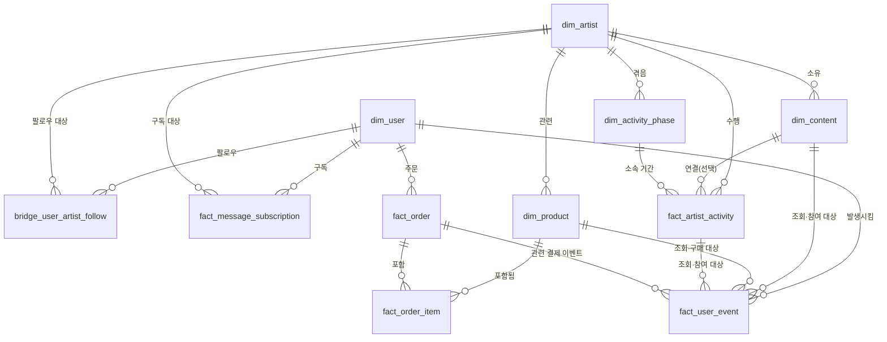

# FANLOG 데이터 사전

> PRD와 이벤트 추적 계획서에 흩어져 있던 테이블 정의를 컬럼 단위로 통합한 문서.
> PostgreSQL DDL 작성의 직접적인 기준으로 사용한다.

## 1. ERD

## 2. 차원 테이블 (dim_*)

### dim_user

| 컬럼 | 타입 | 제약 | 설명 |
| --- | --- | --- | --- |
| user_id | VARCHAR | PK | 가상 팬 식별자 |
| signup_timestamp_utc | TIMESTAMPTZ | NOT NULL | 가입 시각(UTC) |
| signup_date_kst | DATE | NOT NULL | 가입일(KST 파생) |
| country_group | VARCHAR | NOT NULL | 국가 그룹(가상 범주) |
| acquisition_channel | VARCHAR | NOT NULL | 유입 경로(direct/push/social/search) |
| primary_device_type | VARCHAR | NOT NULL | 주 사용 기기(mobile/desktop/tablet) |
| is_deleted | BOOLEAN | NOT NULL, DEFAULT false | 삭제 상태 여부 |
| deleted_at_utc | TIMESTAMPTZ | NULL 허용 | 삭제 처리 시각 |

### dim_artist

| 컬럼 | 타입 | 제약 | 설명 |
| --- | --- | --- | --- |
| artist_id | VARCHAR | PK | 가상 아티스트 식별자 |
| artist_name | VARCHAR | NOT NULL | 가상 아티스트명 (실제 이름 금지) |
| artist_type | VARCHAR | NOT NULL | group/solo |
| debut_year | INT | NULL 허용 | 가상 데뷔 연도 |

### dim_content

| 컬럼 | 타입 | 제약 | 설명 |
| --- | --- | --- | --- |
| content_id | VARCHAR | PK | 콘텐츠 식별자 |
| artist_id | VARCHAR | FK → dim_artist, NOT NULL | 소속 아티스트 |
| content_type | VARCHAR | NOT NULL | notice/photo/video/music_video/live_replay |
| title | VARCHAR | NOT NULL | 콘텐츠 제목(가상) |
| published_timestamp_utc | TIMESTAMPTZ | NOT NULL | 게시 시각 |
| published_date_kst | DATE | NOT NULL | 게시일(KST 파생) |

### dim_product

| 컬럼 | 타입 | 제약 | 설명 |
| --- | --- | --- | --- |
| product_id | VARCHAR | PK | 상품 식별자 |
| artist_id | VARCHAR | FK → dim_artist, NOT NULL | 관련 아티스트 |
| product_name | VARCHAR | NOT NULL | 상품명(가상) |
| product_type | VARCHAR | NOT NULL | album/lightstick/apparel/collab |
| price | NUMERIC | NOT NULL | 기본 가격(KRW) |
| release_timestamp_utc | TIMESTAMPTZ | NOT NULL | 출시 시각 |
| release_date_kst | DATE | NOT NULL | 출시일(KST 파생) |

### dim_activity_phase

| 컬럼 | 타입 | 제약 | 설명 |
| --- | --- | --- | --- |
| phase_id | VARCHAR | PK | 활동 단계 식별자 |
| artist_id | VARCHAR | FK → dim_artist, NOT NULL | 대상 아티스트 |
| phase_type | VARCHAR | NOT NULL | daily/comeback_prep/comeback_active/tour/inactive |
| start_date_kst | DATE | NOT NULL | 단계 시작일 |
| end_date_kst | DATE | NULL 허용 | 단계 종료일(진행중이면 NULL) |

## 3. 관계·연결 테이블

### bridge_user_artist_follow

| 컬럼 | 타입 | 제약 | 설명 |
| --- | --- | --- | --- |
| follow_id | VARCHAR | PK | 팔로우 관계 식별자(surrogate key) |
| user_id | VARCHAR | FK → dim_user, NOT NULL | 팬 |
| artist_id | VARCHAR | FK → dim_artist, NOT NULL | 아티스트 |
| followed_at_utc | TIMESTAMPTZ | NOT NULL | 팔로우 시작 시각 |
| unfollowed_at_utc | TIMESTAMPTZ | NULL 허용 | 팔로우 해제 시각(활성 상태면 NULL) |

### fact_message_subscription

| 컬럼 | 타입 | 제약 | 설명 |
| --- | --- | --- | --- |
| subscription_id | VARCHAR | PK | 구독 식별자 |
| user_id | VARCHAR | FK → dim_user, NOT NULL | 팬 |
| artist_id | VARCHAR | FK → dim_artist, NOT NULL | 아티스트 |
| plan_type | VARCHAR | NOT NULL | monthly(MVP는 단일 값) |
| started_at_utc | TIMESTAMPTZ | NOT NULL | 구독 시작 시각 |
| ended_at_utc | TIMESTAMPTZ | NULL 허용 | 구독 종료 시각 |
| cancel_reason_category | VARCHAR | NULL 허용 | user_cancel/expired_no_renewal |

## 4. 팩트 테이블 (fact_*)

### fact_artist_activity

| 컬럼 | 타입 | 제약 | 설명 |
| --- | --- | --- | --- |
| activity_id | VARCHAR | PK | 활동 식별자 |
| artist_id | VARCHAR | FK → dim_artist, NOT NULL | 수행 아티스트 |
| activity_type | VARCHAR | NOT NULL | post/message/live |
| activity_timestamp_utc | TIMESTAMPTZ | NOT NULL | 발생 시각 |
| activity_date_kst | DATE | NOT NULL | 발생일(KST 파생) |
| content_id | VARCHAR | FK → dim_content, NULL 허용 | 연결 콘텐츠(있는 경우) |
| phase_id | VARCHAR | FK → dim_activity_phase, NULL 허용 | 소속 활동 단계 |
| parameters | JSONB | NULL 허용 | 활동 유형별 추가 속성 |

### fact_user_event

| 컬럼 | 타입 | 제약 | 설명 |
| --- | --- | --- | --- |
| event_id | VARCHAR | PK | 이벤트 식별자 |
| event_name | VARCHAR | NOT NULL | 이벤트명(18개 중 하나) |
| event_timestamp_utc | TIMESTAMPTZ | NOT NULL | 발생 시각 |
| event_date_kst | DATE | NOT NULL | 발생일(KST 파생) |
| user_id | VARCHAR | FK → dim_user, NOT NULL | 팬 |
| session_id | VARCHAR | NULL 허용 | 세션 식별자 |
| artist_id | VARCHAR | FK → dim_artist, NULL 허용 | 관련 아티스트 |
| content_id | VARCHAR | FK → dim_content, NULL 허용 | 관련 콘텐츠 |
| activity_id | VARCHAR | FK → fact_artist_activity, NULL 허용 | 관련 아티스트 활동 |
| product_id | VARCHAR | FK → dim_product, NULL 허용 | 관련 상품 |
| transaction_id | VARCHAR | FK → fact_order, NULL 허용 | 관련 주문 |
| device_type | VARCHAR | NOT NULL | mobile/desktop/tablet |
| traffic_source | VARCHAR | NULL 허용 | direct/push/social/search |
| parameters | JSONB | NULL 허용 | 이벤트별 추가 속성 |

### fact_order

| 컬럼 | 타입 | 제약 | 설명 |
| --- | --- | --- | --- |
| transaction_id | VARCHAR | PK | 주문 식별자 |
| user_id | VARCHAR | FK → dim_user, NOT NULL | 구매 팬 |
| status | VARCHAR | NOT NULL | pending/completed/refunded/partially_refunded |
| order_amount | NUMERIC | NOT NULL | 주문 총액(KRW) |
| refund_amount | NUMERIC | NOT NULL, DEFAULT 0 | 환불 누적액 |
| created_at_utc | TIMESTAMPTZ | NOT NULL | 결제 시작(begin_checkout) 시각 |
| completed_at_utc | TIMESTAMPTZ | NULL 허용 | 결제 완료 시각 |

### fact_order_item

| 컬럼 | 타입 | 제약 | 설명 |
| --- | --- | --- | --- |
| order_item_id | VARCHAR | PK | 주문 상품 식별자 |
| transaction_id | VARCHAR | FK → fact_order, NOT NULL | 소속 주문 |
| product_id | VARCHAR | FK → dim_product, NOT NULL | 상품 |
| quantity | INT | NOT NULL | 수량 |
| unit_price | NUMERIC | NOT NULL | 단가(KRW) |
| discount_amount | NUMERIC | NOT NULL, DEFAULT 0 | 할인액 |

## 5. 분석 마트 (mart_*)

PRD 10.3에 정의된 4개 마트는 위 팩트·차원 테이블에서 SQL로 집계 생성하며,
자체 원본 데이터를 갖지 않는다. 상세 집계 로직은 SQL 작성 단계에서
sql/marts/ 폴더에 쿼리로 구현하고 이 문서에 요약을 추가한다.

| 마트 | 기준 원본 테이블 |
| --- | --- |
| mart_artist_daily | fact_artist_activity, fact_user_event |
| mart_user_daily | fact_user_event, fact_order |
| mart_content_performance | dim_content, fact_user_event |
| mart_commerce_funnel | fact_user_event, fact_order, fact_order_item |
